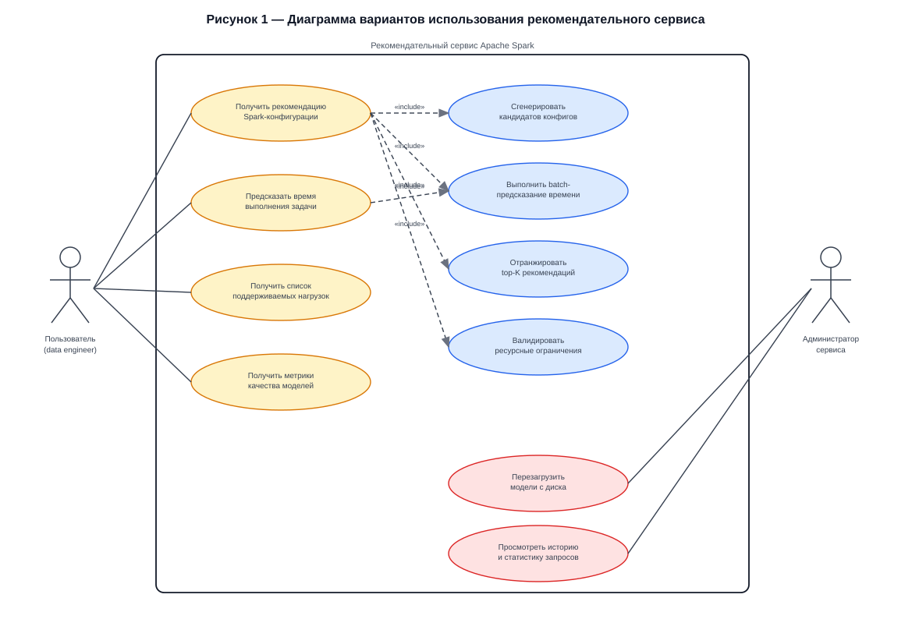
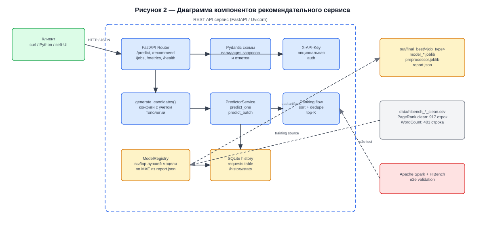
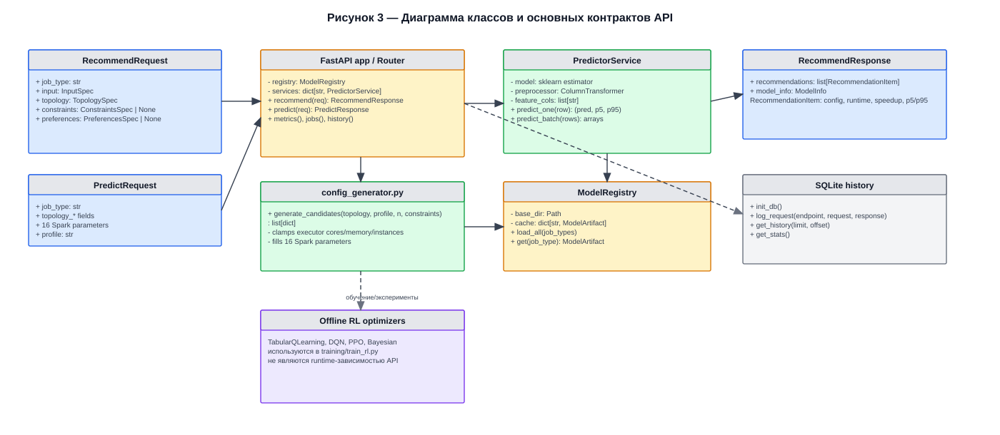
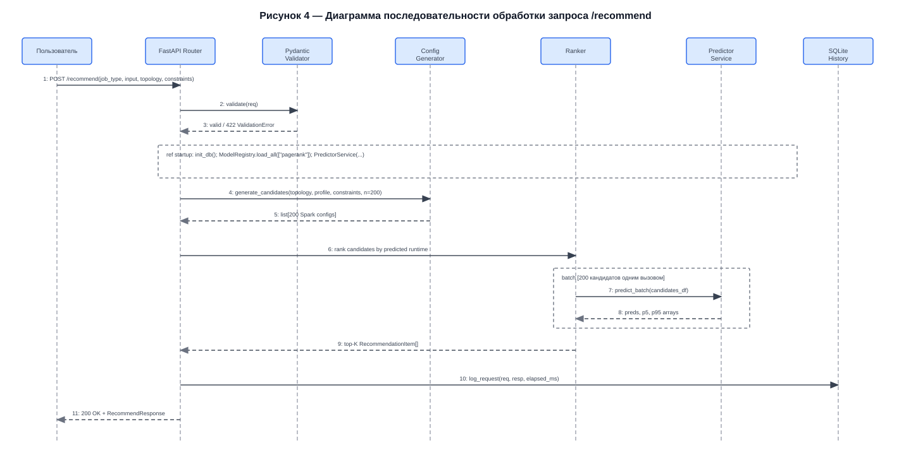
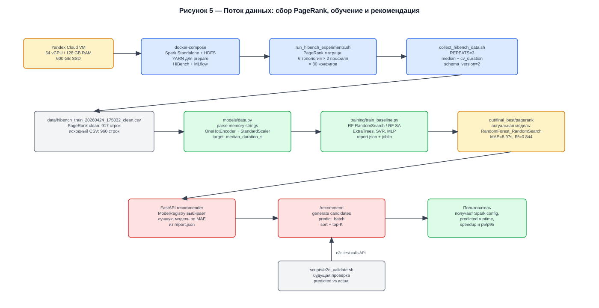

# Вопросы перед реализацией API-сервиса

Документ содержит все открытые вопросы, которые необходимо закрыть до начала написания кода.
Вопросы разбиты на две группы: **архитектурные решения** (выбрать подход) и **ошибки в диаграммах** (исправить drawio).

> Статус на 2026-04-27: основные противоречия в диаграммах исправлены, актуальный исходник лежит в `docs/diagrams/spark_recommender_diagrams.drawio`, SVG-экспорт — в `docs/diagrams/*.svg`.

---

## Часть 1 — Архитектурные решения

### А1. Что такое `input_size_gb` и как он связан с `profile`?

**Проблема.** Датасет обучен на признаке `profile = {small, large}` (enum). API принимает `input_size_gb: float` (реальный размер данных пользователя). Прямого соответствия нет — нужен либо порог перевода, либо новая модель.

**Варианты:**
- `input_size_gb ≤ X → profile=small; > X → profile=large` (простой порог). Какой X?
- Добавить `input_size_bytes` как числовой признак в датасет и переобучить модель. Тогда API принимает реальный размер, и модель учитывает его напрямую — но для этого нужно заново собрать/дополнить датасет.
- Принимать `profile` напрямую от пользователя (не `input_size_gb`). Тогда API не абстрагирует пользователя от внутренних деталей.

**Решить до:** обучения модели и написания `schemas.py`.

---

### А2. Что содержит `ResourcesSpec`?

**Проблема.** В `RecommendRequest` есть поле `resources: ResourcesSpec`, но схема нигде не определена. Нужно решить: пользователь описывает кластер через:

- Точную топологию: `workers=4, worker_cores=8, worker_mem_gb=16` — тогда API знает пространство поиска конфигов.
- Суммарные ресурсы: `total_cores=32, total_mem_gb=64` — тогда нужен алгоритм разбиения на воркеров.
- Один из встроенных шаблонов: `"medium"`, `"large"` — упрощает UI, но скрывает детали.

Выбор влияет на `ConfigGenerator` — он должен знать максимально допустимые `executor_cores`, `executor_instances`, `executor_memory`.

**Решить до:** написания `schemas.py` и `config_generator.py`.

---

### А3. Какой оптимизатор по умолчанию в `/recommend`?

**Проблема.** `OptimizerService` абстрагирует 4 алгоритма: `TabularQLearning`, `DQNOptimizer`, `StableBaselinesOptimizer`, `BayesianOptimizer`. Неясно:
- Какой алгоритм используется по умолчанию?
- Может ли пользователь выбрать алгоритм через запрос?
- Или один алгоритм — always-on, а остальные — эксперименты?

На текущий момент лучший результат в ВКР показывает **Simulated Annealing** поверх RF (MAE 0.746s). RL-агенты дают ~14.6% ускорения, но на новом мультинагрузочном датасете ещё не переобучены.

**Предложение:** начать с RF+SA как дефолт для `/recommend`, RL добавить как опцию `optimizer: "rl"` в запросе позже.

**Решить до:** написания `optimizer_service.py`.

---

### А4. Откуда модели на момент запуска сервиса?

**Проблема.** Сервис ссылается на `out/final_best/<job_type>/`, но этих файлов не существует — обучение на мультинагрузочном датасете ещё не проводилось. Сейчас есть только `models/rf_baseline/model_rf.joblib` для WordCount.

**Нужно:**
1. Дождаться завершения сбора датасета (PageRank, TeraSort, WordCount).
2. Запустить обучение (`training/train_baseline_mlflow.py` с обновлённым `models/data.py`).
3. Только после этого сервис сможет отдавать реальные предсказания.

**Вывод:** до переобучения API можно поднять только с mock-предиктором или моделью WordCount.

---

### А5. Как считается `conf_band` в `PredictorService`?

**Проблема.** В диаграмме последовательности PredictorService возвращает `predicted_runtime, conf_band`. RandomForest не имеет встроенного доверительного интервала. Варианты:
- Std предсказаний отдельных деревьев: `np.std([tree.predict(X) for tree in rf.estimators_])`. Это и есть самый распространённый подход.
- Перцентили предсказаний деревьев (5-й и 95-й).
- Квантильная регрессия (нужна отдельная модель).

**Нужно закрепить формулу** перед написанием `inference.py`, чтобы она была единообразной во всём коде и в отчёте.

---

### А6. Нужна ли версионность URL (`/v1/recommend`)?

**Проблема.** TODO-файл поднимает вопрос об `/v1/`. Для учебного проекта это обычно избыточно, но если API будет использоваться в отчёте как «продакшн», версионность стоит добавить сразу — переименование потом сложнее.

**Варианты:** `POST /recommend` vs `POST /v1/recommend`. Ответ влияет на все примеры в отчёте.

---

### А7. Приоритет хранилища моделей: MLflow Registry или файловая папка?

*(Связано с проблемой на диаграмме компонентов — см. Д2.3)*

`api_and_testing_plan.md` говорит: использовать файловую папку `out/final_best/` + `model_metadata.json`. Но на диаграмме компонентов PredictorService соединён с обоими — MLflow и joblib. Нужно зафиксировать единственный источник истины, иначе `model_registry.py` будет реализован неправильно.

**Рекомендация:** оставить файловую папку (проще деплой), MLflow использовать только для логирования экспериментов при обучении.

---

## Часть 2 — Ошибки и противоречия в диаграммах

> Для просмотра диаграмм — открыть SVG-файлы в папке `docs/diagrams/`.
> Для правки — открыть `diagrams/spark_recommender_diagrams.drawio` в draw.io.

---

### Д1. Use Case диаграмма — лист `1_use_cases`



**Д1.1 — Неверная нотация связей «`>`»**

На диаграмме связи между use case-ами обозначены просто `>`. В UML это не стандартная нотация. Должно быть `«include»` или `«extend»`:
- `«include»` — обязательная подфункция (всегда выполняется).
- `«extend»` — опциональное расширение (выполняется при условии).

Все 5 связей от `uc1` к внутренним UС-ам (`Сгенерировать кандидатов`, `Применить ML-предиктор`, `Применить RL-оптимизатор`, `Валидировать ограничения`) — это `«include»`, они обязательны.

**Исправить:** заменить `>` на `«include»` на всех пяти стрелках.

---

**Д1.2 — Внутренние операции системы показаны как use case-ы**

`Сгенерировать кандидатов конфигов`, `Применить ML-предиктор`, `Применить RL-оптимизатор`, `Валидировать ограничения` — это **внутренние шаги обработки запроса**, а не варианты использования с точки зрения актора. Пользователь не взаимодействует с ними напрямую. В UML use case диаграммах такие элементы обычно либо не показываются вовсе, либо выносятся на отдельную диаграмму деятельности (Activity Diagram).

**Варианты исправления:**
- Убрать их из Use Case диаграммы, оставить только 4 пользовательских и 2 административных UC.
- Или добавить отдельный Activity Diagram для раскрытия внутреннего потока `/recommend`.

---

**Д1.3 — `Управлять версиями моделей` и `Просматривать историю запросов` — нет endpoint-а**

Оба административных use case не имеют соответствующего API endpoint-а в плане реализации (`api_and_testing_plan.md`). Либо нужно добавить endpoint-ы, либо убрать эти UC из диаграммы.

---

### Д2. Диаграмма компонентов — лист `2_components`



**Д2.1 — Лишняя стрелка `ConfigGenerator → PredictorService`**

На диаграмме компонентов есть связь `ConfigGenerator → PredictorService`. Но по диаграмме последовательности (шаги 4–9) `ConfigGenerator` только **генерирует список кандидатов** и возвращает его `APIRouter`. Предсказания для кандидатов делает `OptimizerService`, вызывая `PredictorService` в цикле. `ConfigGenerator` с `PredictorService` не взаимодействует.

**Исправить:** удалить стрелку `ConfigGenerator → PredictorService`.

---

**Д2.2 — `reward = -predicted_time` концептуально неверно**

Стрелка `OptimizerService → PredictorService` подписана `reward = -predicted_time`. Это значит RL-агент получает награду от предиктора, то есть **оптимизирует собственные предсказания**. Это тавтологический цикл: агент учится делать то, что предиктор считает хорошим, а не то, что реально быстрее выполняется.

Правильная архитектура: RL-агент обучается **офлайн на реальных данных** из датасета, не на предсказаниях RF. Предиктор в сервисе используется только для ранжирования кандидатов при инференсе, не для вычисления reward.

**Исправить:** подпись на стрелке заменить на `predict_time(cfg)`, убрать слово `reward`. Если хочется показать RL reward — добавить отдельную стрелку от `датасета` к `OptimizerService` с подписью `reward = -actual_duration`.

---

**Д2.3 — Два хранилища моделей без приоритета**

`PredictorService` соединён с `MLflow Model Registry` и `Файловым хранилищем (joblib)` одновременно. Непонятно, откуда сервис загружает модель при старте. Нужно оставить одно:
- **Файловая папка** `out/final_best/` (по плану из `api_and_testing_plan.md`) — рекомендуется.
- **MLflow Model Registry** — избыточно для одиночного разработчика.

**Исправить:** убрать одну из стрелок (скорее всего MLflow), оставив только файловое хранилище.

---

### Д3. Диаграмма классов — лист `3_classes`



**Д3.1 — `APIRouter` содержит ссылку на `PredictorService`**

В классе `APIRouter` есть поле `- predictor: PredictorService`. Но по диаграмме последовательности `APIRouter` никогда не вызывает `PredictorService` напрямую — только `OptimizerService` вызывает его внутри цикла. Поле лишнее.

**Исправить:** убрать `- predictor: PredictorService` из `APIRouter`.

---

**Д3.2 — Сигнатура `OptimizerService.optimize()` не совпадает с диаграммой последовательности**

- В диаграмме классов: `optimize(topo, profile, k) : List`
- В диаграмме последовательности (шаг 6): `optimize(candidates, predictor, top_k)`

Это противоречие. Нужно выбрать одну сигнатуру и синхронизировать оба листа.

**Рекомендуемая сигнатура** (согласно архитектуре): `optimize(candidates: List[SparkConfig], top_k: int) -> List[Recommendation]` — candidates приходят из ConfigGenerator, топология уже в них закодирована.

---

**Д3.3 — Вспомогательные классы не определены**

В атрибутах и методах используются типы, которые нигде не показаны как классы:
- `ResourcesSpec` (в `RecommendRequest`)
- `ConstraintsSpec`
- `PreferencesSpec`
- `Recommendation`
- `ModelInfo`
- `ModelMetadata`

Для отчёта достаточно показать хотя бы `ResourcesSpec` и `Recommendation` — они ключевые для понимания контракта.

---

**Д3.4 — Усечённые поля (текст обрезан в drawio)**

Несколько полей классов видны неполностью из-за ограничения ширины ячейки:
- `RecommendRequest.constraints:` — обрезано (нет типа)
- `APIRouter.generator: ConfigG` — обрезано
- `ConfigGenerator.generate_candidates(constraints, n=200, ` — обрезано
- `PredictorService.predict(features: DataFr` — обрезано

**Исправить:** расширить ячейки классов по горизонтали в drawio.

---

### Д4. Диаграмма последовательности — лист `4_sequence_recommend`



**Д4.1 — Нет альтернативного блока `alt` для ошибки валидации**

Шаг 3 показывает `ok / 400 ValidationError` как единственное сообщение. По UML в диаграмме последовательностей для разветвления нужен блок `alt`:
```
alt [валидация прошла]
  → продолжить
else [400]
  → вернуть ошибку, прекратить
```
Без этого непонятно, что происходит при ошибке.

---

**Д4.2 — Шаг 4: `generate_candidates(constraints, n=200)` — откуда topology?**

`ConfigGenerator.generate_candidates()` должен знать ресурсный потолок топологии (max executor_cores, max executor_instances), чтобы не генерировать невалидные конфиги. В текущей диаграмме `APIRouter` передаёт только `constraints` — нет явной передачи информации о топологии/ресурсах. Нужно либо включить `resources` в аргументы, либо показать, что `constraints` уже содержит ресурсные ограничения.

---

**Д4.3 — Цикл `loop` по кандидатам — должен быть батч**

Блок `loop [для каждой конфигурации]` с вызовом `predict(features)` на каждую из 200 конфигураций по отдельности — это O(200) вызовов. `sklearn` RandomForest поддерживает батч-предсказание: `model.predict(X)` принимает матрицу 200×N и возвращает 200 результатов за один вызов. Это на порядок быстрее.

**Исправить:** заменить `loop` на одно сообщение `predict_batch(candidates_df → 200 rows)` → `[200 predicted runtimes]`.

---

**Д4.4 — Нет шага инициализации (загрузки модели)**

Диаграмма показывает только обработку запроса, но не показывает, что происходит при старте сервиса: когда и как `PredictorService` загружает модель из `out/final_best/`. Для отчёта рекомендуется добавить отдельную диаграмму последовательности `on_startup()` или добавить её как `ref` блок в начале текущей.

---

### Д5. Диаграмма потока данных — лист `5_data_flow`



**Д5.1 — CSV содержит только PageRank (не TeraSort и WordCount)**

На диаграмме узел датасета подписан: `hibench_train_*.csv: TeraSort, PageRank, WordCount`. По факту на `2026-04-26` собран только PageRank (960 строк). TeraSort и WordCount ещё предстоит собрать. Диаграмма опережает реальность.

**Исправить перед финальной версией отчёта:** обновить после завершения сбора.

---

**Д5.2 — Стрелка `REST API → Валидация` в неверном направлении**

На диаграмме показана связь `API → Валидация predicted vs actual`. Это означает, что API инициирует валидацию. Но валидация — это отдельный e2e-тест (`tests/e2e/run_predicted_vs_actual.py`), который внешний скрипт запускает против поднятого API. Направление стрелки должно быть обратным: `Валидационный скрипт → API`.

**Исправить:** развернуть стрелку, добавить метку `e2e тест`.

---

**Д5.3 — Нет обратной связи от валидации к переобучению**

Диаграмма потока данных не показывает, что делать с результатами валидации. В реальной ML-системе `validation_results.csv` должен использоваться для решения о переобучении модели. Для отчёта добавить стрелку `Валидация → (при отклонении > порога) → Переобучение`.

---

## Итоговый чеклист

| # | Вопрос | Тип | Блокер? |
|---|--------|-----|---------|
| А1 | `input_size_gb` vs `profile` — схема перевода | Архитектура | ✅ да |
| А2 | Определить `ResourcesSpec` | Схема API | ✅ да |
| А3 | Алгоритм оптимизатора по умолчанию | Архитектура | ✅ да |
| А4 | Модели не обучены на новом датасете | Данные | ✅ да |
| А5 | Формула `conf_band` | Алгоритм | нет |
| А6 | URL версионность `/v1/` | Дизайн API | нет |
| А7 | MLflow vs файловая папка — источник модели | Архитектура | ✅ да |
| Д1.1 | Нотация `>` → `«include»` в Use Case | Drawio | нет |
| Д1.2 | Внутренние шаги — не UC | Drawio | нет |
| Д1.3 | `Управлять версиями` — нет endpoint | Drawio/API | нет |
| Д2.1 | Лишняя связь `ConfigGenerator→PredictorService` | Drawio | нет |
| Д2.2 | `reward=-predicted_time` — концептуальная ошибка | Drawio | ✅ да |
| Д2.3 | Два хранилища — определить приоритет | Drawio | ✅ да |
| Д3.1 | Лишнее поле `predictor` в `APIRouter` | Drawio | нет |
| Д3.2 | Сигнатура `optimize()` разная в двух диаграммах | Drawio | ✅ да |
| Д3.3 | Вспомогательные классы не определены | Drawio | нет |
| Д3.4 | Усечённые поля классов | Drawio | нет |
| Д4.1 | Нет `alt` блока для 400 ValidationError | Drawio | нет |
| Д4.2 | Topology не передаётся в `ConfigGenerator` | Drawio | ✅ да |
| Д4.3 | `loop` → батч-предсказание | Drawio | нет |
| Д4.4 | Нет шага загрузки модели при старте | Drawio | нет |
| Д5.1 | CSV — только PageRank, не все нагрузки | Drawio | нет |
| Д5.2 | Стрелка `API→Валидация` — неверное направление | Drawio | нет |
| Д5.3 | Нет петли обратной связи валидация→переобучение | Drawio | нет |

**Блокеры для старта реализации (не отложить):** А1, А2, А3, А4, А7, Д2.2, Д2.3, Д3.2, Д4.2.
