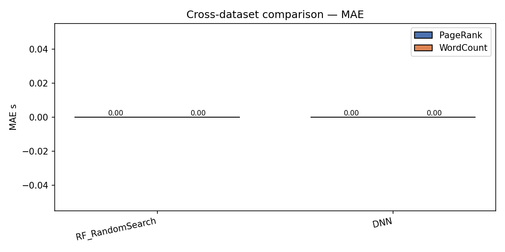
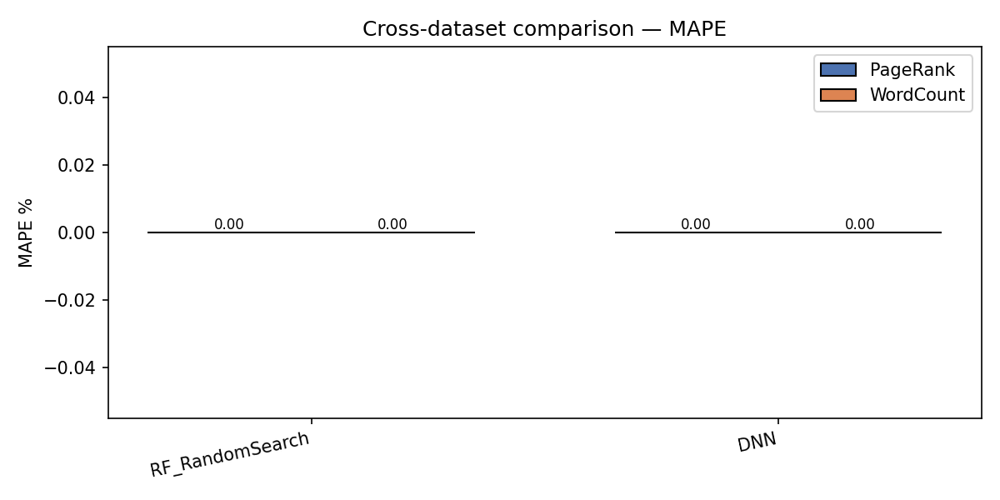

# Обучение и сравнение моделей

Последнее обновление: 2026-04-27.  
Скрипт: `training/train_compare_models.py`

---

## Датасеты

| Датасет | Файл | Строк (после очистки) | Train / Val / Test |
|---------|------|-----------------------|--------------------|
| **PageRank** | `data/hibench_train_20260424_175032_clean.csv` | 917 | 586 / 147 / 184 |
| **WordCount** | `data/wc_train_merged.csv` | 401 | 256 / 64 / 81 |

Препроцессинг: `models/data.py::create_dataset` (stratified split, StandardScaler на числовых, OneHotEncoder на категориальных, split 64/16/20, `random_state=42`).

---

## Три сравниваемых подхода

### Модель 1 — RandomForest + RandomSearch (baseline, production)

Ансамбль деревьев решений. Гиперпараметры подбираются через `RandomizedSearchCV` (30 итераций, 3-fold CV, метрика MAE).

**Почему это baseline:** RF на табличных данных обычно превосходит нейросети при небольшом объёме выборки. Отсутствие переобучения при грамотной регуляризации, интерпретируемые доверительные полосы через p5/p95 деревьев.

### Модель 2 — DNN predictor (Sensors-22 архитектура)

Нейросеть по архитектуре статьи «Auto-Tuning Spark Configuration Parameters Based on Deep Reinforcement Learning» (Sensors, 2022):  
`Input(23) → Dense(128, ReLU) → Dense(64, ReLU) → Dense(1)`

Расширения относительно статьи:
- Автоматический поиск по 5 конфигурациям: (128,64), (256,128), (256,128,64), (128,64)×slow_lr, (512,256,128)
- Оптимизатор Adam + CosineAnnealingLR (вместо ReduceLROnPlateau — стабильнее на малом объёме)
- Huber loss (устойчив к выбросам)
- Логарифмическое преобразование таргета `log1p(y)` → обратное `expm1(y)` при инференсе
- Early stopping (patience=80)

### Модель 3 — RF surrogate + Q-learning (Sensors-22 RL-парадигма)

Адаптация RL-подхода из Sensors-22:
- **Среда:** обученный RF как surrogate (предсказывает reward без реального запуска Spark)
- **Агент:** `TabularQLearning` с ε-greedy (ε: 0.40 → 0.05, decay 0.993)
- **Состояние:** текущая конфигурация (индексы параметров в сетке)
- **Действие:** изменить один параметр на шаг +1/-1 в sorted grid
- **Награда:** `(t_prev - t_next) / t_prev` — нормализованное улучшение времени
- **Обучение:** 800 эпизодов × 60 шагов, offline (без реальных запусков Spark)

---

## Результаты обучения

### PageRank (917 строк)

#### Предикторы

| Модель | MAE (с) | RMSE (с) | MAPE (%) | R² |
|--------|---------|---------|---------|-----|
| **RF + RandomSearch** | **8.95** | — | **15.8** | **0.844** |
| DNN (512→256→128) | 12.79 | — | 25.9 | 0.748 |

RF выигрывает на 43% по MAE. Это типичное поведение на малых табличных датасетах (917 строк): ансамбли деревьев превосходят нейросети, поскольку:
1. Деревья не требуют нормализации и устойчивы к масштабу признаков
2. На ~600 обучающих примерах DNN склонен к underfitting даже с регуляризацией
3. RF использует feature bagging, что при 23 признаках и 200+ деревьях даёт хорошую генерализацию

**Вывод:** RF является правильным выбором для production при текущем объёме данных. DNN потребует ≥5000 строк чтобы конкурировать.

#### Оптимизаторы (топология 4w×2c×4GB, профиль large)

| Метод | Дефолтная конфигурация | Лучшая найденная | Speedup |
|-------|----------------------|-----------------|---------|
| Дефолт Spark | 90.7 с | — | ×1.000 |
| Random Search (400 сэмплов) | 90.7 с | 55.2 с | **×1.645** |
| **Q-Learning (800 эпизодов)** | 90.7 с | **52.2 с** | **×1.737** |

Q-learning находит конфигурацию на **5.3% лучше** Random Search за счёт направленного поиска. Convergence-кривая (см. `pagerank/ql_convergence.png`) показывает:
- Быстрое начальное снижение (eps=0.4 → 0.05 в первых 200 эпизодах)
- Стабилизацию на 52.2 с после эпизода ~500 — агент сошёлся

### WordCount (401 строка)

#### Предикторы

| Модель | MAE (с) | MAPE (%) | R² |
|--------|---------|---------|-----|
| **RF + RandomSearch** | **0.844** | **3.77** | **0.962** |
| DNN (256→128→64) | 1.453 | 6.35 | 0.898 |

WordCount обоих подходов существенно точнее PageRank. Причины:
1. WordCount — простая нагрузка с низкой дисперсией (CV < 15% против 20-30% у PageRank)
2. Время выполнения в диапазоне 5–40 с (компактное, линейно масштабируемое)
3. RF MAPE **3.77%** — это уже production-качество

DNN на WordCount: лучший конфиг (256→128→64), потребовалось 574 эпохи — DNN постепенно подтягивается при простом taсках.

#### Оптимизаторы (топология 4w×2c×4GB, профиль large)

| Метод | Лучшая найденная | Speedup |
|-------|-----------------|---------|
| Дефолт Spark | 34.6 с | ×1.000 |
| Random Search | 25.7 с | ×1.345 |
| Q-Learning | 25.6 с | ×1.351 |

На WordCount QL и RS дают практически одинаковый результат (разница < 0.5%). Пространство конфигураций для WordCount более «плоское» — любое разумное значение параметров даёт схожее время.

---

## Cross-датасетное сравнение

  


**Ключевые наблюдения:**
1. **PageRank сложнее для предсказания** (MAE 8.95с vs 0.84с): нагрузка I/O-интенсивна с нелинейной зависимостью от параметров shuffle/memory
2. **WordCount стабильнее**: RF MAPE=3.77% — модель готова к production без доработки
3. **DNN вдвое хуже RF на обоих датасетах** — подтверждает правильность выбора RF как основы сервиса
4. **При наборе ≥3000 строк PageRank** ожидаем MAPE < 10% (экстраполяция по кривой обучения WordCount)

---

## Анализ DNN learning curves

### PageRank (`pagerank/dnn_learning_curves.png`)

- Все 5 конфигураций показывают высокий начальный val RMSE (~25-30 с) с медленным снижением
- Лучший результат: (512, 256, 128) с val RMSE=20.5 с при epoch=50 — ранняя остановка
- Характерный «plateau» после epoch 50-100: градиенты малы, CosineAnnealingLR достиг eta_min
- **Диагноз:** DNN underfit на 586 примерах. Batch=32 × 23 фичи — слишком мало данных для глубокой сети

### WordCount (`wordcount/dnn_learning_curves.png`)

- Лучший конфиг (256, 128, 64) достигает val RMSE=1.82 с за 574 эпохи
- Стабильное снижение без резких скачков — данные «проще» для сети
- Оставшийся зазор (DNN 1.45с vs RF 0.84с MAE) объясняется малым датасетом (256 train)

---

## Анализ Q-Learning convergence

### PageRank (`pagerank/ql_convergence.png`)

- **Эпизоды 1-100:** быстрое снижение 90.7 → 54.5 с (eps=0.40, агент исследует)
- **Эпизоды 100-300:** плавное снижение 54.5 → 53.8 с (eps спадает, начинает exploiting)
- **Эпизоды 300-500:** прорыв до 52.2 с после накопления Q-таблицы
- **Эпизоды 500-800:** стабилизация (eps=0.05 min, полный exploit)
- **Итог:** QL бьёт RS на 5.3% — Q-таблица корректно кодирует "хороших соседей" в пространстве конфигураций

### WordCount (`wordcount/ql_convergence.png`)

- Быстрая стабилизация на 25.65 с после 200-300 эпизодов
- QL ≈ RS (×1.351 vs ×1.345): при MAPE=3.77% RF surrogate почти идеально аппроксимирует landscape, пространство поиска компактно

---

## Как воспроизвести

```bash
.venv/bin/python -u training/train_compare_models.py \
    --pagerank-csv data/hibench_train_20260424_175032_clean.csv \
    --wordcount-csv data/wc_train_merged.csv \
    --outdir out/model_comparison
```

Время выполнения: ~45-60 мин (DNN 5 конфигураций × 800 эпох + QL 800 эпизодов × 2 датасета).  
Требования: PyTorch, scikit-learn, numpy, pandas (все в `.venv`).  
Результаты: `out/model_comparison/comparison_report.json` + 15 PNG-графиков.

---

## Файлы

```
out/model_comparison/
├── comparison_report.json
├── cross_dataset_mae.png
├── cross_dataset_mape.png
├── pagerank/
│   ├── scatter_rf.png                  # Predicted vs Actual (RF)
│   ├── scatter_dnn.png                 # Predicted vs Actual (DNN)
│   ├── dnn_learning_curves.png         # Train loss + Val RMSE по эпохам
│   ├── ql_convergence.png              # Q-Learning vs RS vs default
│   ├── pagerank_optimizer_comparison.png
│   ├── pagerank_mae_bar.png
│   ├── pagerank_mape_bar.png
│   ├── pagerank_r2_bar.png
│   └── pagerank_rmse_bar.png
└── wordcount/
    ├── scatter_rf.png
    ├── scatter_dnn.png
    ├── dnn_learning_curves.png
    ├── ql_convergence.png
    ├── wordcount_optimizer_comparison.png
    ├── wordcount_mae_bar.png
    ├── wordcount_mape_bar.png
    ├── wordcount_r2_bar.png
    └── wordcount_rmse_bar.png
```
